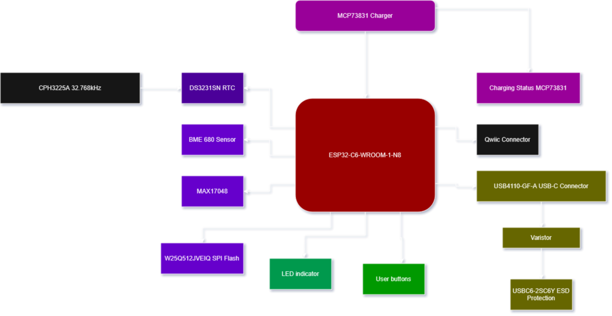
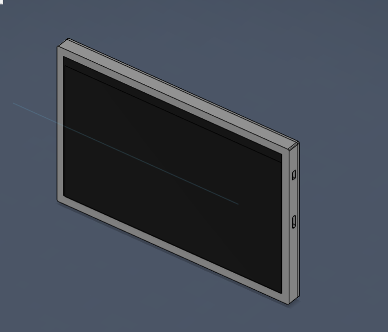
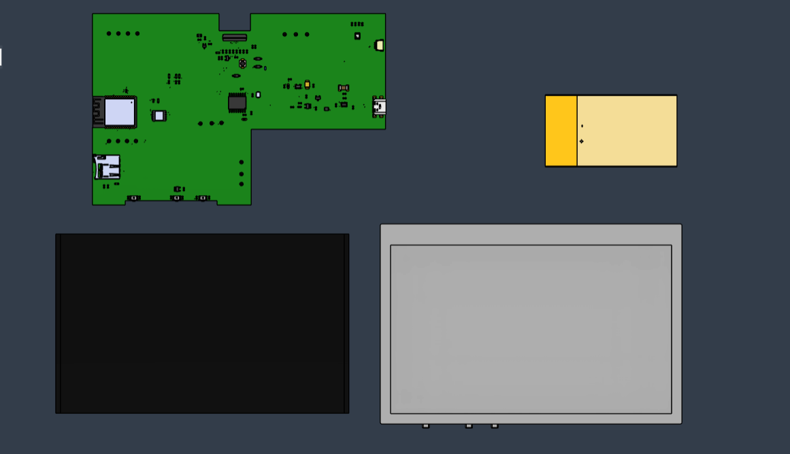
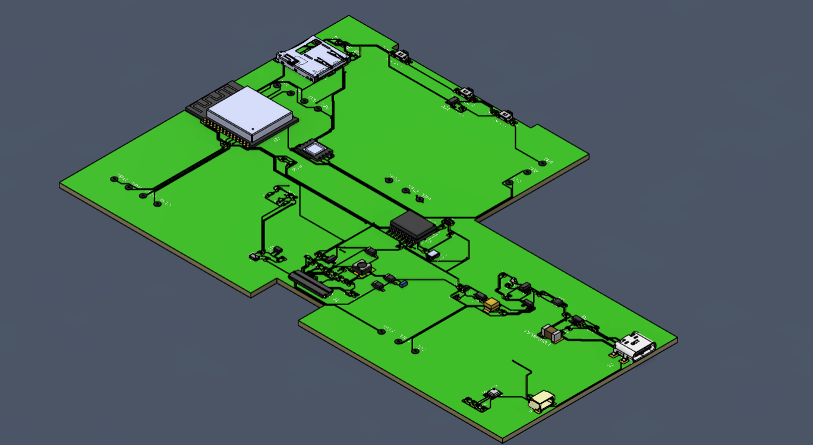

# Bill of Materials
| Componenta    | Link | Datasheet
| -------- | ------- |--------|
| ESP32_WROVER_EAGLE-LTSPICE_RR0402  | https://www.snapeda.com/parts/RC0402FR-07226RL/Yageo/view-part/    |https://www.snapeda.com/parts/RC0402FR-07226RL/Yageo/datasheet/
| QWIIC_CONNECTORJS-1MM | https://www.snapeda.com/parts/PRT-14417/SparkFun/view-part/     |https://www.snapeda.com/parts/PRT-14417/SparkFun%20Electronics/datasheet/
|BUTTON_CUSYOMV1|https://industry.panasonic.com/global/en/downloads?tab=cad&small_g_cd=203&part_no=EVQPUJ02K&q=RVZRUFVKMDJLJTdDMTMlN0MyMDMlN0MzNDU5JTdDMSU3QyU3QyU3Q2ZhbHNl|https://industry.panasonic.com/global/en/downloads?tab=catalog&small_g_cd=203&part_no=EVQPUJ02K&q=RVZRUFVKMDJLJTdDMTMlN0MyMDMlN0MzNDU5JTdDMSU3QyU3QzIlN0NmYWxzZQ%3D%3D
|ESP32_WROVER_EAGLE-LTSPICE_CC0402|https://componentsearchengine.com/part-view/CC0402MRX5R5BB106/YAGEO|https://componentsearchengine.com/Datasheets/2/CC0402MRX5R5BB106.pdf
|CPH3225A|https://www.snapeda.com/parts/CPH3225A/Seiko+Instruments/view-part/?ref=eda|https://www.snapeda.com/parts/CPH3225A/Seiko%20Instruments/datasheet/|
|ADAFRUIT_LEDCHIP-LED0603|https://www.snapeda.com/parts/KP-1608SURCK/Kingbright/view-part/?ref=search&t=LED%200603|https://www.snapeda.com/parts/KP-1608SURCK/Kingbright/datasheet/
|112A-TAAR-R03_ATTEND|https://store.comet.bg/en/Catalogue/Product/43497/|https://store.comet.bg/en/Catalogue/Product/43497/|
|744043680IND_4828-WE-TPC_WRE|https://www.digikey.sg/en/models/1638515|https://www.we-online.com/components/products/datasheet/744043680.pdf
|BD5229G-TR|https://componentsearchengine.com/part-view/BD5229G-TR/ROHM%20Semiconductor|https://datasheet.datasheetarchive.com/originals/distributors/Datasheets_SAMA/f2b9741ef86007909f138d561a359946.pdf|
|CPH3225A|https://www.snapeda.com/parts/CPH3225A/Seiko+Instruments/view-part/?ref=eda|https://www.snapeda.com/parts/CPH3225A/Seiko%20Instruments/datasheet/|
|DS3231SN|https://www.snapeda.com/parts/DS3231SN%23/Analog+Devices/view-part/?ref=eda|https://www.snapeda.com/parts/DS3231SN%23/Analog%20Devices/datasheet/|
|ESP32-C6-WROOM-1-N8|https://www.snapeda.com/parts/ESP32-C6-WROOM-1-N8/Espressif+Systems/view-part/?ref=eda|https://www.snapeda.com/parts/ESP32-C6-WROOM-1-N8/Espressif%20Systems/datasheet/
|MCP73831|https://www.digikey.com/en/models/1874108|https://ww1.microchip.com/downloads/aemDocuments/documents/APID/ProductDocuments/DataSheets/MCP73831-Family-Data-Sheet-DS20001984H.pdf|
|ESP32_WROVER_BME680_BME680|https://www.snapeda.com/parts/BME680/Bosch/view-part/?welcome=home|https://www.snapeda.com/parts/BME680/Bosch%20Sensortec/datasheet/|
|ESP32_WROVER_EAGLE-LTSPICE_CC0402|https://componentsearchengine.com/Datasheets/2/CC0402MRX5R5BB106.pdf|https://componentsearchengine.com/part-view/CC0402MRX5R5BB106/YAGEO|
|ESP32_WROVER_SPARKFUN-DISCRETESEMI_MOSFET_PCH-DMG2305UX-7|https://componentsearchengine.com/part-view/DMG2305UX-7/Diodes%20Incorporated|https://www.diodes.com//assets/Datasheets/DMG2305UX.pdf|
|ESP32C6_VARISTORCN1812|https://www.mouser.co.uk/ProductDetail/EPCOS-TDK/B72520T0350K062?qs=dEfas%2FXlABIszF52uu7vrg%3D%3D|https://www.tdk-electronics.tdk.com/inf/75/db/CTVS_14/Surge_protection_series.pdf|
|FH34SRJ-24S-0.5SH_99_|https://componentsearchengine.com/part-view/XC6220A331MR-G/Torex|https://product.torexsemi.com/system/files/series/xc6220.pdf|
|MAX17048G+T10|https://www.snapeda.com/parts/MAX17048G+T10/Analog+Devices/view-part/?ref=eda|https://www.snapeda.com/parts/MAX17048G+T10/Analog%20Devices/datasheet/|
|MBR0530|https://ro.mouser.com/ProductDetail/KYOCERA-AVX/SD0805S020S1R0?qs=jCA%252BPfw4LHbpkAoSnwrdjw%3D%3D|https://ro.mouser.com/datasheet/2/40/schottky-3165252.pdf|
|PGB1010603MR|https://www.snapeda.com/parts/PGB1010603MR/Littelfuse/view-part/?ref=eda|https://www.snapeda.com/parts/PGB1010603MR/Littelfuse%20Inc./datasheet/|
|RCL_CPOL-EUCT3528|https://ro.mouser.com/ProductDetail/Vishay-Sprague/TR3B106K025C1300?qs=jCGqFXxTmLdffnuDkXzk1g%3D%3D|https://www.vishay.com/docs/40080/tr3.pdf|
|SAMACSYS_PARTS_USB4110-GF-A|https://componentsearchengine.com/part-view/USB4110-GF-A/GCT%20(GLOBAL%20CONNECTOR%20TECHNOLOGY)|https://gct.co/files/drawings/usb4110.pdf|
|SI1308EDL-T1-GE3|https://componentsearchengine.com/part-view/SI1308EDL-T1-GE3/Vishay|https://componentsearchengine.com/Datasheets/1/SI1308EDL-T1-GE3.pdf|
|SJ|https://grabcad.com/library/solder-jumpers-1||
|USBLC6-2SC6Y|https://www.snapeda.com/parts/USBLC6-2SC6Y/STMicroelectronics/view-part/?ref=eda|https://www.snapeda.com/parts/USBLC6-2SC6Y/STMicroelectronics/datasheet/|
|W25Q512JVEIQ|https://www.snapeda.com/parts/W25Q512JVEIQ/Winbond+Electronics/view-part/?ref=eda|https://www.snapeda.com/parts/W25Q512JVEIQ/Winbond%20Electronics/datasheet/|
|XC6220A331MR-G|https://componentsearchengine.com/part-view/XC6220A331MR-G/Torex|https://product.torexsemi.com/system/files/series/xc6220.pdf|

# Functionalitati Hardware
## Microcontroller
Microcontroller principal: ESP32-C6-WROOM-1-N8

    Interfețe: UART, I²C, SPI, GPIO, ADC, PWM, USB 2.0

    Comunicare wireless: WiFi 6 (802.11ax), Bluetooth 5.0 Low Energy, Zigbee & Thread (prin IEEE 802.15.4)

    Memorie: 8 MB Flash

    Rol: Controler central ce gestionează comunicația cu toate perifericele și modulele externe. Este responsabil pentru achiziția de date, procesare și trimiterea lor către o interfață (de ex. server sau aplicație mobilă).

Ceas în timp real: DS3231SN

    Tip: RTC (Real-Time Clock) cu compensare termică

    Interfață: I²C

    Rol: Asigură măsurarea precisă a timpului, util pentru timestamp-ul datelor colectate de senzori.

Senzor de mediu: BME680

    Măsoară: Temperatură, presiune, umiditate și compuși organici volatili (VOC)

    Interfață: I²C (poate fi și SPI)

    Rol: Oferă date esențiale de mediu pentru aplicații IoT, monitorizare atmosferică etc.

### Managementul energiei
MCP73831

    Rol: Încărcător Li-Ion / Li-Po

    Interfață: Analogică, configurabilă prin rezistențe externe

    Caracteristici: Control al curentului de încărcare, protecții integrate

MAX17048G+T10

    Rol: Fuel Gauge IC

    Interfață: I²C

    Funcții: Măsoară tensiunea și estimează nivelul bateriei (SoC - state of charge)

Memorie externă: W25Q512JVEIQ

    Tip: NOR Flash, 512Mbit

    Interfață: SPI

    Rol: Stocare de date (loguri, configurări, firmware OTA)

Protecție și integritate electrică

    USBLC6-2SC6Y – Protecție ESD pentru liniile USB

    PGB1010603MR – Protecție împotriva descărcărilor electrostatice (ESD)

    SI1308EDL-T1-GE3 / DMG2305UX-7 – MOSFET pentru comutarea energiei sau protecție

    BD5229G-TR – Regulator LDO de 2.9V

    Varistor CN1812 (B72520T0350K062) – Protecție la supratensiuni

    Diodă Schottky (MBR0530) – Prevenirea curenților inversi

Conectivitate externă

    QWIIC_CONNECTORJS-1MM – Conector pentru I²C (QWIIC standard, modular, plug-and-play)

    SAMACSYS_PARTS_USB4110-GF-A – USB-C pentru alimentare și comunicare

    112A-TAAR-R03_ATTEND – Conector placă-la-placă

    SJ (Solder Jumpers) – Permite configurarea opțională a traseelor prin punți de lipit

Feedback vizual & control

    ADAFRUIT_LEDCHIP-LED0603 (KP-1608SURCK) – LED de status

    BUTTON_CUSYOMV1 (EVQPUJ02K) – Buton mecanic, folosit pentru reset, input de utilizator sau inițierea unei funcții

# Total consum
Componentă|	Consum tipic|
|-------|----------|
|ESP32-C6|	~130mA |
|BME680|	~3.1µA (low power)|	
|DS3231SN|	~200nA	|
|MAX17048|	~23µA	|
|MCP73831|	până la 500mA|	
|LED-uri|	~2-10mA	|

Total estimativ în mod activ: ~150-180mA

## Conexiuni componente la pini ESP32-C6
RTC – DS3231SN

    Interfață: I²C

    Pini ESP32-C6 folosiți:

        GPIO8 – I²C SDA

        GPIO9 – I²C SCL

    Motiv: GPIO8 și GPIO9 sunt frecvent utilizați pentru magistrala I²C pe ESP32-C6 deoarece pot fi configurate software și sunt ușor de accesat. SDA și SCL trebuie trase cu rezistențe de pull-up (tipic 4.7kΩ).

Senzor mediu – BME680

    Interfață: I²C (partajează magistrala cu DS3231)

    Pini ESP32-C6 folosiți:

        GPIO8 – SDA

        GPIO9 – SCL

    Motiv: Magistrala I²C permite conectarea în paralel a mai multor dispozitive, fiecare având adresă unică.

Fuel Gauge – MAX17048

    Interfață: I²C

    Pini: Aceeași magistrală I²C (GPIO8 & GPIO9)

    Motiv: MAX17048 are adresă I²C fixă, deci trebuie verificat să nu fie conflict cu celelalte două componente (nu e cazul aici).

Memorie externă – W25Q512JVEIQ

    Interfață: SPI

    Pini ESP32-C6:

        GPIO4 – SPI MOSI

        GPIO5 – SPI MISO

        GPIO6 – SPI CLK

        GPIO7 – SPI CS

    Motiv: Aceste GPIO-uri sunt pinii SPI hardware dedicați pe ESP32-C6 și asigură performanță maximă și compatibilitate cu interfața SPI (QSPI în cazul memoriei).

LED (KP-1608SURCK)

    Interfață: GPIO (digital out, cu rezistor în serie)

    Pin:

        GPIO3 – LED Control

    Motiv: GPIO3 este un pin liber cu capabilități PWM, ceea ce permite și control al intensității (dimming), nu doar on/off.

Buton (EVQPUJ02K)

    Interfață: GPIO + Pull-up intern

    Pin:

        GPIO0 – Buton utilizator

    Motiv: GPIO0 este adesea folosit și pentru bootloader/reset (cu atenție la stări în timpul pornirii). E un pin convenabil pentru input digital.

Qwiic Connector (I²C extensibil)

    Pini: I²C SDA/SCL partajați

        GPIO8 – SDA

        GPIO9 – SCL

    Motiv: Qwiic folosește același protocol I²C, deci toate dispozitivele compatibile Qwiic se pot lega în paralel la acești pini.

MCP73831 – Încărcare baterie

    Pini:

        VBUS / USB – Alimentare 5V

        STAT pin legat la GPIO10 (monitorizare charging status)

    Motiv: GPIO10 este configurabil ca input pentru a citi starea de încărcare (LED status al MCP73831 conectat la pinul STAT).

MAX17048 – Fuel Gauge

    Alimentare + I²C (vezi mai sus)

    INT (optional): Conectat la GPIO1

    Motiv: GPIO1 poate fi configurat cu întrerupere (interrupt) pentru notificări despre nivelul bateriei critic/scăzut.

USB4110-GF-A – USB-C connector

    Funcție: Alimentare 5V și comunicație

    Pin USB D+ / D- conectați la:

        GPIO18 – USB D+

        GPIO19 – USB D-

    Motiv: ESP32-C6 are suport USB nativ. Aceste GPIO-uri sunt default pentru perifericul USB Device.

Alte conexiuni:

    CPH3225A (oscilator 32.768 kHz) – utilizat pentru RTC, conectat la pinul dedicat RTC_CLKIN (sau la DS3231 dacă nu e folosit direct de MCU)

    MOSFET & diodă Schottky – control și protecție, comutarea pinilor GPIO pentru pornire/oprire module

    Varistor, rezistențe, condensatori – pasive pentru protecție, filtrare și stabilitate electrică (nu folosesc GPIO-uri direct)

